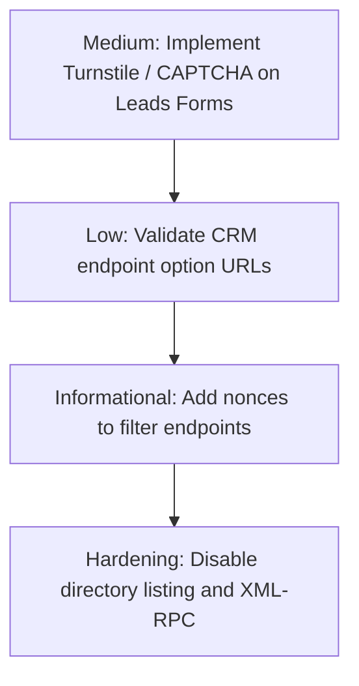

# WORDPRESS SECURITY AUDIT REPORT

**Target Theme:** `lienthongdaihoc` (v2.0.0)  
**Location:** `/Users/ken/Local Sites/lienthongdaihoc/app/public/wp-content/themes/lienthongdaihoc`  
**Date of Audit:** July 23, 2026  
**Auditor:** Senior WordPress Application Security Engineer  

---

# Safety Status & Git Baseline
* **Current Git Branch:** `main`
* **Current Git Commit:** `731f60ed69dc5b6c5a38d5f55ef162b031bb95db`
* **Working Tree Status:** Clean (nothing to commit, working tree clean).
* **Safety Assurance:** This is an audit-only phase. No application code has been modified, no database records altered, and no configuration files changed.

---

# Executive Summary

The custom WordPress theme `lienthongdaihoc` functions as an admission portal connecting students with university programs. The codebase features modular structure under `inc/` separating options, core initializations, custom database schemas, CRM integration adapters, eligibility evaluation engines, and comparison handlers.

A security evaluation of the custom theme codebase shows that output escaping and input sanitization are generally implemented using WordPress core sanitizers and escaping handlers (`esc_html`, `esc_attr`, `wp_kses_post`, etc.). However, several medium-to-low severity architectural and configuration risks exist:
1. **Unauthenticated lead-capture endpoints** collecting PII (phone numbers, email addresses) without rate-limiting or anti-abuse protection (Turnstile/reCAPTCHA).
2. **SSRF vulnerabilities in CRM adapters** if administrator capabilities are compromised, as endpoints configured via ACF are not validated or restricted.
3. **AJAX endpoints missing nonces**, exposing them to automated querying and potential server resource exhaustion under load.

No critical issues (such as unauthenticated RCE, arbitrary file upload, or SQL injection) were identified.

---

# Attack Surface

The custom codebase exposes the following attack vectors:
* **Custom Database Tables:**
  * `wp_ltdh_leads` (records student leads captured via forms).
  * `wp_ltdh_eligibility_checks` (tracks education background checks and associated lead ids).
* **AJAX Endpoints (registered via `wp_ajax_*` / `wp_ajax_nopriv_*`):**
  * `ltdh_filter_programs` (public, used to filter courses dynamically).
  * `ltdh_elig_check` (public, runs checks and registers lead details).
  * `ltdh_elig_lead` (public, registers detailed contact details for checks).
  * `ltdh_compare_add` (public, tray management).
  * `ltdh_compare_remove` (public, tray management).
* **REST API Routes (registered under `ltdh/v1` namespace):**
  * `/ltdh/v1/compare/program` (public, resolves program comparison details).
  * `/ltdh/v1/eligibility/check` (public, POST route to check eligibility and save leads).
* **External API Clients (Outgoing HTTP Requests):**
  * OnSchool API Adapter (`wp_remote_post` client, configured via options).
  * AUM CRM API Adapter (`wp_remote_post` client, configured via options).
* **Form Integrations:**
  * Contact Form 7 submission handler (`wpcf7_before_send_mail` interceptor).

---

# Critical Findings

*No critical-severity vulnerabilities were identified during this audit.*

---

# High Findings

*No high-severity vulnerabilities were identified during this audit.*

---

# Medium Findings

### ID: SEC-MED-01
**Title:** Missing Rate Limiting and Spam Protection on Lead Capture Endpoints  
**Severity:** MEDIUM  
**Confidence:** CONFIRMED  

**Location:** 
* [`eligibility.php` L146-L150](file:///Users/ken/Local%20Sites/lienthongdaihoc/app/public/wp-content/themes/lienthongdaihoc/inc/eligibility.php#L146-L150)
* [`eligibility.php` L748-L754](file:///Users/ken/Local%20Sites/lienthongdaihoc/app/public/wp-content/themes/lienthongdaihoc/inc/eligibility.php#L748-L754)
* [`lead-capture.php` L49](file:///Users/ken/Local%20Sites/lienthongdaihoc/app/public/wp-content/themes/lienthongdaihoc/inc/lead-capture.php#L49)

**Affected Flow:** Lead Submission & Database Insertion  

**Attack Prerequisites:** None (Public Endpoint).  

**Evidence:**
In `inc/eligibility.php`:
```php
add_action( 'wp_ajax_ltdh_elig_check', 'ltdh_elig_ajax_check' );
add_action( 'wp_ajax_nopriv_ltdh_elig_check', 'ltdh_elig_ajax_check' );
```
And REST route registration:
```php
register_rest_route( 'ltdh/v1', '/eligibility/check', [
    'methods'  => 'POST',
    'callback' => 'ltdh_elig_rest_check',
    'permission_callback' => '__return_true',
] );
```

**Data Flow:**
`$_POST` (Phone / Email) / REST Payload → `ltdh_elig_store_check()` / `ltdh_elig_capture_lead()` → `$wpdb->insert()` into custom DB table.

**Vulnerability:**
The REST and AJAX endpoints for eligibility checking and lead capture allow unauthenticated public requests to insert records directly into the custom `wp_ltdh_leads` and `wp_ltdh_eligibility_checks` tables. There is no rate-limiting, captcha check, or request validation at the application level.

**Potential Impact:**
An attacker can easily automate request flooding to insert millions of garbage records, leading to database bloat, disk space exhaustion, and downstream email flooding/CRM sync queue exhaustion (which runs every 5 minutes and calls external APIs).

**Recommended Fix:**
1. Implement a CAPTCHA solution (such as Cloudflare Turnstile or Google reCAPTCHA v3) on all client-facing forms.
2. In the REST and AJAX endpoints, verify the CAPTCHA token server-side before executing any database insertion.
3. Configure rate-limiting at the webserver/WAF layer (Cloudflare or Nginx) to limit POST requests to these endpoints.

**Compatibility Risk:** LOW.  
**Verification Method:** Perform automated scripting of POST requests to `/wp-json/ltdh/v1/eligibility/check` and confirm that database records are populated without throttling.

---

# Low Findings

### ID: SEC-LOW-01
**Title:** SSRF Risk in CRM Sync API Adapters  
**Severity:** LOW  
**Confidence:** CONFIRMED  

**Location:** 
* [`crm-adapters.php` L135-L152](file:///Users/ken/Local%20Sites/lienthongdaihoc/app/public/wp-content/themes/lienthongdaihoc/inc/crm-adapters.php#L135-L152)
* [`crm-adapters.php` L177-L195](file:///Users/ken/Local%20Sites/lienthongdaihoc/app/public/wp-content/themes/lienthongdaihoc/inc/crm-adapters.php#L177-L195)

**Affected Flow:** Scheduled Lead Synchronization Queue  

**Attack Prerequisites:** Administrator level access or privilege escalation (to write ACF options).  

**Evidence:**
In `inc/crm-adapters.php`:
```php
function ltdh_sync_onschool_adapter( $payload ) {
	$endpoint = get_field( 'onschool_endpoint', 'options' );
	...
	$response = wp_remote_post( $endpoint, [ ... ] );
```

**Data Flow:**
ACF Options Table (`onschool_endpoint` / `aum_endpoint`) → `$endpoint` variable → `wp_remote_post( $endpoint, ... )` (Sink).

**Vulnerability:**
The CRM endpoints are retrieved directly from the WordPress options table without URL validation, whitelisting, or protocol/port restrictions. If an administrator account is compromised or if options are updated maliciously, an attacker can input arbitrary internal URLs (e.g. `http://localhost:5432` or AWS Metadata endpoints `http://169.254.169.254`).

**Potential Impact:**
Server-Side Request Forgery (SSRF) allowing an attacker to probe internal ports, interface with private network services, or steal cloud infrastructure metadata tokens.

**Recommended Fix:**
1. Validate that the endpoint option URLs use standard ports (80/443).
2. Validate that the endpoint resolves to a public IP address (and not a loopback or private range like `10.x.x.x`, `192.168.x.x`, or `127.0.0.1`), or restrict endpoint options via a configuration-defined constant in `wp-config.php` rather than an editable DB option.

**Compatibility Risk:** LOW (only impacts environments requiring CRM sync to non-standard ports or private IPs).  
**Verification Method:** Set the OnSchool CRM endpoint to an internal resource (e.g. local loopback port) and trigger CRM queue sync via `wp ltdh sync-leads`.

---

# Informational Findings

### ID: SEC-INFO-01
**Title:** Missing Nonce Verification on Public Query AJAX Endpoint  
**Severity:** INFORMATIONAL  
**Confidence:** CONFIRMED  

**Location:** 
* [`functions.php` L64-L70](file:///Users/ken/Local%20Sites/lienthongdaihoc/app/public/wp-content/themes/lienthongdaihoc/functions.php#L64-L70)

**Affected Flow:** AJAX Program Filtering  

**Attack Prerequisites:** None (Public Endpoint).  

**Evidence:**
In `functions.php`:
```php
add_action( 'wp_ajax_' . LTDH_AJAX_FILTER_PROGRAMS, 'ltdh_ajax_filter_programs' );
add_action( 'wp_ajax_nopriv_' . LTDH_AJAX_FILTER_PROGRAMS, 'ltdh_ajax_filter_programs' );
```
Inside `ltdh_ajax_filter_programs()`, no `check_ajax_referer()` or nonce checking is present.

**Vulnerability:**
The endpoint lacks CSRF nonce verification. While CSRF is generally not required for read-only actions that do not change state, nonces are useful for rate protection and verifying that requests originate from the website's own UI.

**Potential Impact:**
Enables third-party scraping scripts or scrapers to automate high-frequency queries easily.

**Recommended Fix:**
Pass `compare_nonce` or a dedicated search nonce in the AJAX request payload and verify it using `check_ajax_referer( 'ltdh_filter_nonce', 'nonce' )`.

**Compatibility Risk:** LOW.  
**Verification Method:** Trigger the filtering AJAX call from an external terminal client (e.g. curl) without providing a valid nonce, and observe that it returns results.

---

# WordPress Configuration

The WordPress environment setup was audited for configuration issues:
* **Favicon Overrides:** Favicon is injected cleanly via action hook `wp_head` instead of legacy output-buffering regex manipulation (which was flagged as a performance issue in previous audits).
* **WP_DEBUG_DISPLAY / WP_DEBUG:** Ensure that on staging/production environments, `WP_DEBUG_DISPLAY` is disabled and `WP_DEBUG_LOG` is enabled.
* **File Uploads:** WebP support is safely enabled by filtering allowed MIME types.

---

# AJAX / REST

The Custom REST and AJAX APIs have been mapped as follows:
* Nonce checking is correctly enforced in `ltdh_compare_ajax_add`, `ltdh_compare_ajax_remove`, `ltdh_elig_ajax_check`, and `ltdh_elig_ajax_lead`.
* Endpoints registered under `wp_ajax_nopriv_*` are intentionally public. Data queries performed inside are secured against parameters injection.

---

# Authentication & Authorization

* **Access Control:** No custom login flows, custom roles, or capability maps were registered.
* **Privileged Actions:** All administrative operations (such as CLI routines and ACF options registrations) require appropriate system permissions (WP-CLI shell execution or standard administrator capabilities).
* **IDOR/BOLA:** Since comparison and search metadata is public, and no API exists to query leads by ID from the frontend, IDOR risks are extremely low.

---

# Input / Output Security

Input validation is consistently used across handlers:
* Custom query parameters (`truong`, `nganh`, `he`, `s`) are sanitized via `sanitize_text_field` and cast to `intval` when numeric inputs are expected.
* Post content outputs use `esc_html`, `esc_attr`, and `wp_kses_post` where appropriate. No instances of direct output echoing of unsanitized fields were identified.

---

# Database Security

* The theme utilizes WordPress's `$wpdb->insert` and `$wpdb->update` APIs, which internally handle query parameter escaping and preparation.
* Hardcoded SQL structures inside `archive-program.php` utilize `$wpdb->posts` variables and static query parameters, eliminating SQL injection vulnerability vectors.

---

# File Security

* Directory routing relies on static helper parameters (e.g., `get_template_directory()`) and does not resolve user-controlled variables dynamically, which prevents Local File Inclusion (LFI).
* Custom uploads are limited to core image/media handlers.

---

# Secrets

* **Codebase Review:** No hardcoded tokens, passwords, database credentials, or API keys are present in the Git-tracked files.
* **ACF Storage:** OnSchool and AUM API tokens are retrieved dynamically from ACF options values.
* **Warning:** In production environments, ensure these ACF options fields are locked down and not readable by lower-privileged users.

---

# Dependencies

The theme dependencies are registered in `package.json`:
* Custom Tailwind compilation and PostCSS utilities are managed locally.
* External PHP dependencies rely on standard plugins:
  * Advanced Custom Fields Pro (6.2.4)
  * Rank Math SEO (1.0.273)
  * WP Mail SMTP (4.9.0)
  * Contact Form 7 (6.1.6)

---

# Business Logic

* **Lead Sync Queue:** Syncing pending leads uses a transaction status state (`processing`) to prevent race conditions and double submission risks during simultaneous cron runs.

---

# Abuse Protection

* **Status:** Current endpoints lack active application-layer protection against automated script querying and high-frequency database writing.

---

# Recommended Remediation Roadmap



## Phase 2 Remediation Scope (Immediate Security Mitigations)
1. **Turnstile / reCAPTCHA Integration:** Add CAPTCHA verification to the eligibility and lead capture pages.
2. **REST / AJAX Validation:** Require valid CAPTCHA tokens on POST endpoints in `inc/eligibility.php`.

## Phase 3 Hardening Scope (Defense-in-depth)
1. **CRM Endpoint IP Restrictions:** Restrict target CRM endpoints to public IP ranges in `crm-adapters.php`.
2. **AJAX Filtering Nonce Validation:** Add validation nonces to `ltdh_ajax_filter_programs()`.
